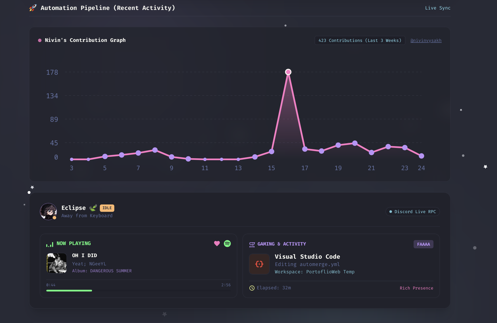
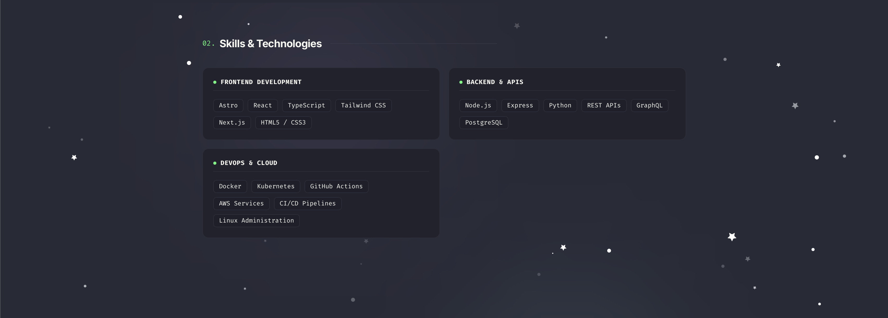
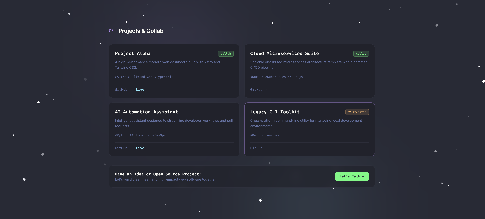
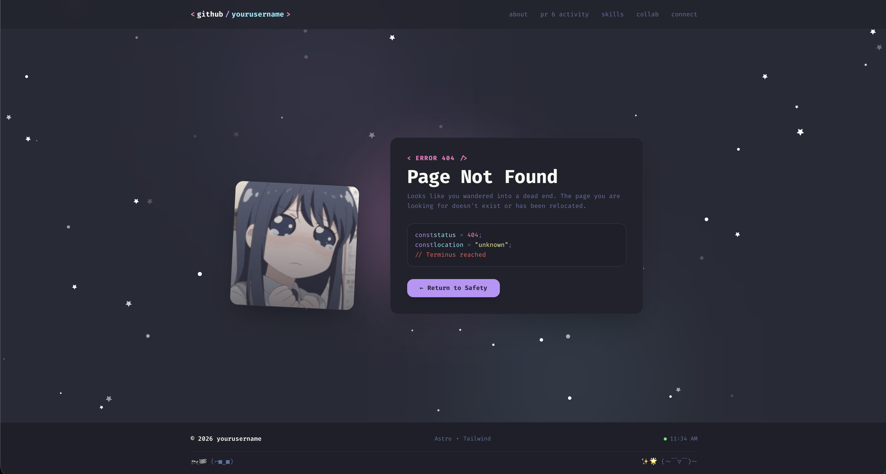

# 🦇 Dracula Developer Portfolio Template 🚀

<br>


[](https://nivinvysakh.netlify.app)
[](https://astro.build)
[](https://tailwindcss.com)
[](https://www.typescriptlang.org)
[](https://www.docker.com)
[](https://nginx.org)
[](https://opensource.org/licenses/MIT)

A modern, minimalist, retro Dracula-themed developer portfolio and GitHub README-style showcase template built with **Astro 7**, **Tailwind CSS v4**, **TypeScript**, and **Docker**.

🔗 **Live Preview**: [https://nivinvysakh.netlify.app](https://nivinvysakh.netlify.app)

Designed for developers, DevOps engineers, and designers who want a fast, stylish, and highly customizable personal website.

---

## ✨ Features

- 🎨 **Authentic Dracula Theme Palette**: Premium dark mode styling using official Dracula color tokens (`#282a36`, `#44475a`, `#f8f8f2`, `#bd93f9`, `#ff79c6`, `#8be9fd`, `#50fa7b`, `#ffb86c`).
- ⚡ **Lightning Fast (Astro 7 + Tailwind CSS v4)**: Static site generation with near-zero runtime JavaScript, sub-second load times, and responsive mobile-first typography.
- 🎵 **Live Discord & Spotify Presence (Lanyard)**: Real-time Discord status (Online/Idle/DND/Offline), custom status messages, live Spotify playback with progress bar, and active game/IDE rich presence. **Auto-hides cleanly** if no Discord ID is configured.
- 📊 **Dynamic GitHub Contribution Wave Graph**: Interactive SVG contribution graph synced live with GitHub activity. **Auto-hides** if unconfigured or unavailable.
- 🚀 **GitHub PR & Activity Log**: Live interactive tab switcher tracking public Pull Requests and commit events directly via GitHub API.
- 🛠️ **Centralized Configuration**: Customize your entire portfolio (name, bio, avatar, skills, tech stack, social links, projects) simply by editing `src/config.ts`.
- 🐳 **Docker & NGINX Ready**: Multi-stage `dockerfile` supporting hot-reloaded development and optimized NGINX Alpine production serving with custom floating 404 page routing.
- 🛡️ **Graceful Fallbacks**: Smart component visibility — features automatically collapse without broken layouts when third-party data is unavailable.

---

## 📸 Screen Shots

|           **🏠 Home Page & Profile**           |             **⚡ Activity & Live Presence**              |
| :--------------------------------------------: | :------------------------------------------------------: |
|          |                        |
|      **🚀 Dedicated PR & Activity Page**       |               **🛠️ Skills & Technologies**               |
|  |                            |
|        **💻 Projects & Collaboration**         |                 **📬 Contact & Footer**                  |
|              |  |
|       **👻 Floating Sad Anime 404 Page**       |                                                          |
|                   |                                                          |

---

## 🚀 Quick Start

### Prerequisites

- **Node.js** (v18.0.0 or higher recommended)
- **npm** / **pnpm** / **yarn**

### 1. Clone the repository

```bash
git clone https://github.com/yourusername/dracula-portfolio.git
cd dracula-portfolio
```

### 2. Install dependencies

```bash
npm install
```

### 3. Run development server

```bash
npm run dev
```

Open [http://localhost:4321](http://localhost:4321) in your browser to view your site with instant hot-reloading.

---

## ⚙️ Configuration & Personalization

All personal details, socials, tech stack items, and projects are centralized in [`src/config.ts`](file:///Users/nivin/Desktop/Dev/PortoflioWeb%20Temp/src/config.ts):

```typescript
export const SITE_CONFIG = {
  // 1. Basic Profile Info
  name: "yourusername", // Your GitHub username
  title: "Full-Stack Developer & DevOps Engineer",
  tagline: "Building scalable web apps & automating the cloud.",
  description: "Minimalist Dracula-themed developer portfolio template.",
  email: "your.email@example.com",

  // 2. Integrations
  discordId: "123456789012345678", // Your 17-20 digit Discord User ID (leave dummy/empty to auto-hide)
  avatarUrl: "https://github.com/yourusername.png",

  // 3. Optional: Firebase Realtime Database (for Spotify playback history)
  firebaseConfig: {
    apiKey: import.meta.env.PUBLIC_FIREBASE_API_KEY || "YOUR_API_KEY",
    authDomain:
      import.meta.env.PUBLIC_FIREBASE_AUTH_DOMAIN ||
      "your-project.firebaseapp.com",
    databaseURL:
      import.meta.env.PUBLIC_FIREBASE_DATABASE_URL ||
      "https://your-project-default-rtdb.firebaseio.com",
    projectId: import.meta.env.PUBLIC_FIREBASE_PROJECT_ID || "your-project-id",
    storageBucket:
      import.meta.env.PUBLIC_FIREBASE_STORAGE_BUCKET ||
      "your-project.firebasestorage.app",
    messagingSenderId:
      import.meta.env.PUBLIC_FIREBASE_MESSAGING_SENDER_ID || "123456789012",
    appId:
      import.meta.env.PUBLIC_FIREBASE_APP_ID ||
      "1:123456789012:web:abcdef1234567890",
  },

  // 4. Showcase Favorite Songs
  favoriteSongs: [
    { song: "Starboy", artist: "The Weeknd" },
    { song: "Midnight City", artist: "M83" },
  ],

  // 5. GitHub README Bio Card
  readmeInfo: {
    greeting: "Hello there 👋",
    status_ico: "⚡",
    status: "Building awesome open-source projects...",
    focus: "Full-Stack Development & Cloud Architecture",
    cloud: "AWS • Docker • Kubernetes",
    scripting: "TypeScript • Python • Bash",
    vibe: "Coffee, Code & Lofi Beats ☕🎧",
    learning: "Rust & Distributed Systems",
  },

  // 6. Social Links
  socials: [
    { name: "GitHub", url: "https://github.com/yourusername" },
    { name: "Twitter / X", url: "https://x.com/yourusername" },
    { name: "LinkedIn", url: "https://linkedin.com/in/yourusername" },
  ],

  // 7. Tech Stack Badges & Skills
  techStack: [
    {
      name: "TypeScript",
      icon: "https://cdn.simpleicons.org/typescript/3178C6",
    },
    { name: "React", icon: "https://cdn.simpleicons.org/react/61DAFB" },
    { name: "Astro", icon: "https://cdn.simpleicons.org/astro/BC52EE" },
    { name: "Docker", icon: "https://cdn.simpleicons.org/docker/2496ED" },
  ],

  skills: [
    {
      category: "Frontend Development",
      items: ["Astro", "React", "TypeScript", "Tailwind CSS"],
    },
  ],

  // 8. Projects & Showcase
  projects: [
    {
      title: "Project Alpha",
      description: "A high-performance modern web dashboard.",
      tags: ["Astro", "Tailwind CSS", "TypeScript"],
      github: "https://github.com/yourusername/project-alpha",
      demo: "https://project-alpha.example.com",
      openForCollab: true,
    },
  ],
};
```

### 💡 Enabling Discord Live Presence (Lanyard)

1. Join the [Lanyard Discord Server](https://discord.gg/lanyard) so the bot can track your status.
2. Enable Discord Developer Mode and copy your **Discord User ID**.
3. Paste it into `discordId` in `src/config.ts`.

> [!NOTE]
> If `discordId` is left unconfigured or the user is not found, the Discord/Spotify widget **automatically hides itself**.

---

## Docker Setup

You can run the portfolio in Docker for both **development** and **production**:

### 1. Development Container (Hot Reload)

```bash
docker compose up -d dracula-portfolio-dev
```

- **URL**: [http://localhost:4321](http://localhost:4321)

### 2. Production Container (NGINX Alpine)

```bash
docker compose up -d --build dracula-portfolio-prod
```

- **URL**: [http://localhost:8080](http://localhost:8080)
- **Test 404 Page**: [http://localhost:8080/invalid-route](http://localhost:8080/invalid-route) (renders custom floating sad anime 404 page).

### 3. Stop Containers

```bash
docker compose down
```

---

## 📦 Available Scripts

| Command               | Action                                                         |
| :-------------------- | :------------------------------------------------------------- |
| `npm run dev`         | Starts local development server at `http://localhost:4321`     |
| `npm run build`       | Runs Astro diagnostic check and builds static site to `./dist` |
| `npm run preview`     | Previews the build output locally                              |
| `npm run astro check` | Runs Astro compiler and TypeScript type checks                 |

---

## 🚢 Deployment

Deploy in seconds to your preferred static hosting platform:

- **Netlify**: Connect your repository — build command: `npm run build`, publish directory: `dist`.
- **Vercel**: Select Astro framework preset — build command: `npm run build`, output directory: `dist`.
- **Cloudflare Pages**: Framework preset `Astro`, output directory: `dist`.
- **GitHub Pages**: Build with the provided GitHub Actions CI/CD workflow.

---

## 📄 License

Distributed under the [MIT License](LICENSE.MD). Feel free to star ⭐️, fork, customize, and build your dream portfolio!
